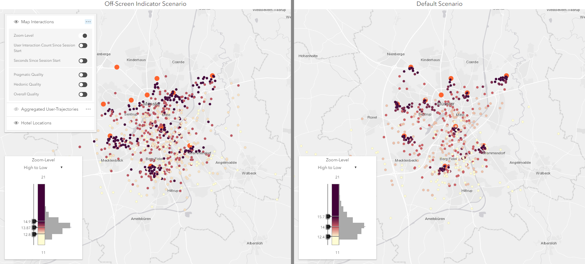

# Session Viewer
## Visual Analytics Toolkit for Evaluating Map Interaction in WebGIS

This web application lets you consume, process, visualize, and analyze WebGIS session data by providing interactive visualizations (visual analytics capabilities).



## Usage

### Minimal Configuration

Change the settings in ``src/appConfig.ts``:

1. Consume data from your Elasticsearch instance by using the URL to the corresponding index via ``elasticsearch_url`` (e.g. ``http://localhost:9200/mapapps/_search``

2. Choose the field name and values of your A/B testing scenarios vai ``appIds`` (e.g. ``["beispielnutzerstudiecrownhotels","beispielnutzerstudiedefaulthotels"]``

2. Include additional data sources, like task relevant geometries via``taskGeometriesLayer`` (e.g. FeatureServer URLs)

### Start, Test, and Build Application

This application is written in [TypeScript](http://www.typescriptlang.org/) and utilizes the [`@arcgis/webpack-plugin`](https://github.com/Esri/arcgis-webpack-plugin).

You can develop, test, and build the application using various commands.

Run the application in development mode with a local development server.
```sh
npm start
```

Run the unit tests for the application. Unit tests are written with [Intern](https://theintern.io/).
```sh
npm test
```

Build the application for deployment.
```sh
npm run build
```

Run a production build of the application, but serve it up locally to see how the built app will behave.
```sh
npm run serve
```

Use `npm run serve` to full test that Service Workers are working correctly with `webpack-dev-server` self signed certifcates. Refer to [this article](https://deanhume.com/testing-service-workers-locally-with-self-signed-certificates/) on how to run Chrome with proper flags enabled for development purposes.
